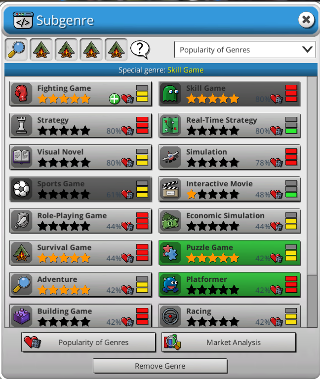

Adds the function that shows which genre matches to the genre you have selected.

## Installation
1. Download the [latest release](https://github.com/LavaGang/MelonLoader/releases) of MelonLoader and install it for Mad Games Tycoon 2.
2. Download the [latest release](https://github.com/derpierre65/MGT_BestGenreCombination/releases) release and extract to the mods directory.